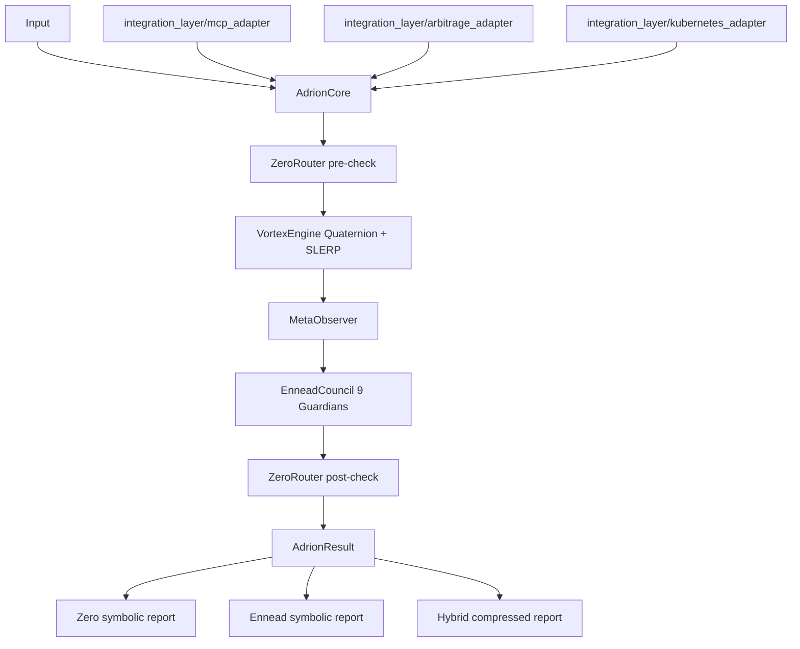

# ARCHITEKTURA SCALANIE_CALOSCI (v1)

## Cel
Warstwa SCALANIE_CALOSCI dodaje kompletne F0-F4 jako rozszerzenie non-breaking wobec obecnego rdzenia ADRION 369.

## Zakres wdrożenia
- F0: Punkt Zero
- F1: MetaObserver
- F2: VortexEngine + Quaternion
- F3: Ennead Guardians
- F4: Kompresja symbolic/hybrid
- Dodatkowo: UNITY_FIELD i Protokół Cienia

## Struktura

```text
core/
  zero/
    zero_state.py
    zero_router.py
  observer/
    meta_observer.py
  vortex/
    engine.py
  math/
    quaternion.py
guardians/
  ennead.py
compression/
  style_guide.py
  seed_encoder.py
core/unity_field.py
core/shadow_protocol.py
```

## Opis modułów

### F0 Punkt Zero
- `ZeroRouter` przepuszcza każdą decyzję przez bramkę rezonansu.
- `ZeroState.evaluate()` sprawdza progi:
  - `resonance_score >= 0.90`
  - `entropy_level <= 0.25`
- `force_to_zero()` resetuje stan do singularności: `R=1.0`, `E=0.0`.

### F1 MetaObserver
- Monitoruje: `resonance_score`, `entropy_level`, `trinity_vector`.
- Eskaluje do Punktu Zero przy niskiej koherencji.
- Zwraca raport symboliczny do lekkiej telemetrii.

### F2 Vortex + Quaternion
- `Quaternion` zapewnia normalizację i `SLERP`.
- `VortexEngine.rotate()` realizuje płynne przejścia stanu.
- `benchmark_rotation()` dostarcza metryki wydajności.

### F3 Ennead Guardians
- `EnneadCouncil` ocenia 9 opiekunów.
- Twarde veto dla `Privacy` i `Nonmaleficence`.
- Decyzja: `PROCEED` lub `DENY`.

### F4 Kompresja i komunikacja
- `CompressionStyleGuide`:
  - `symbolic()` do wewnętrznej wymiany
  - `hybrid()` do wymiany człowiek-system
- `SeedEncoder` tworzy deterministyczny skrót `SEED-*`.

### UNITY_FIELD
- Scala metryki z warstw: zero, observer, vortex.

### Protokół Cienia
- `redact()` maskuje pola wrażliwe (`token`, `secret`).
- `resilience_hint()` klasyfikuje poziom stabilności.

## Jak to wszystko działa razem

Toroidalny rdzeń jest uruchamiany przez `AdrionCore`, który stanowi jedyny punkt wejścia dla decyzji aplikacyjnych oraz adapterów integracyjnych.

1. Input trafia do `AdrionCore.process_decision()`.
2. `ZeroRouter` wykonuje pre-check (bez twardego resetu).
3. `VortexEngine` wykonuje rotację stanu Quaternion+SLERP.
4. `MetaObserver` ocenia koherencję i przygotowuje skompresowany raport.
5. `EnneadCouncil` uruchamia 9 Strażników z wagami i polityką hard-block.
6. `ZeroRouter` wykonuje post-check (z opcją force-to-zero przy DENY).
7. Wynik wraca jako `AdrionResult` z raportem symbolicznym Zero + Ennead oraz raportem hybrydowym.

### Diagram przepływu



## Walidacja
Dodane testy pokrywają:
- routing Punktu Zero,
- wykrywanie MetaObserver,
- poprawność kwaternionów,
- wydajność Vortex,
- stabilność długoterminową,
- kompresję i seed encoding,
- smoke test end-to-end.

## Uruchomienie

```bash
python -m pytest tests/test_zero_router.py -v
python -m pytest tests/test_meta_observer_detection.py -v
python -m pytest tests/test_quaternion_vortex.py -v
python -m pytest tests/test_system_resonance.py -v
python -m pytest tests/test_long_term_stability.py -v
python -m pytest tests/test_scalanie_smoke.py -v
```
